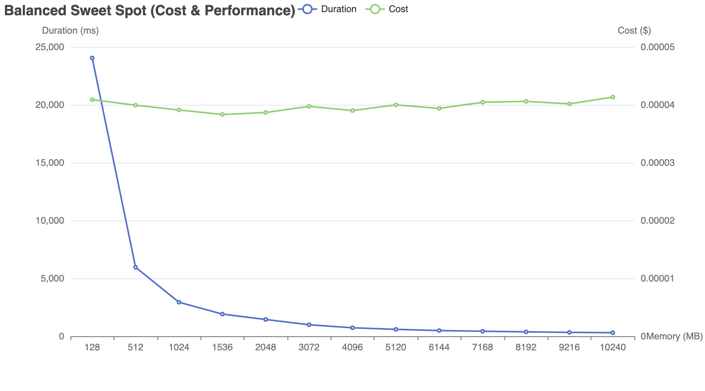
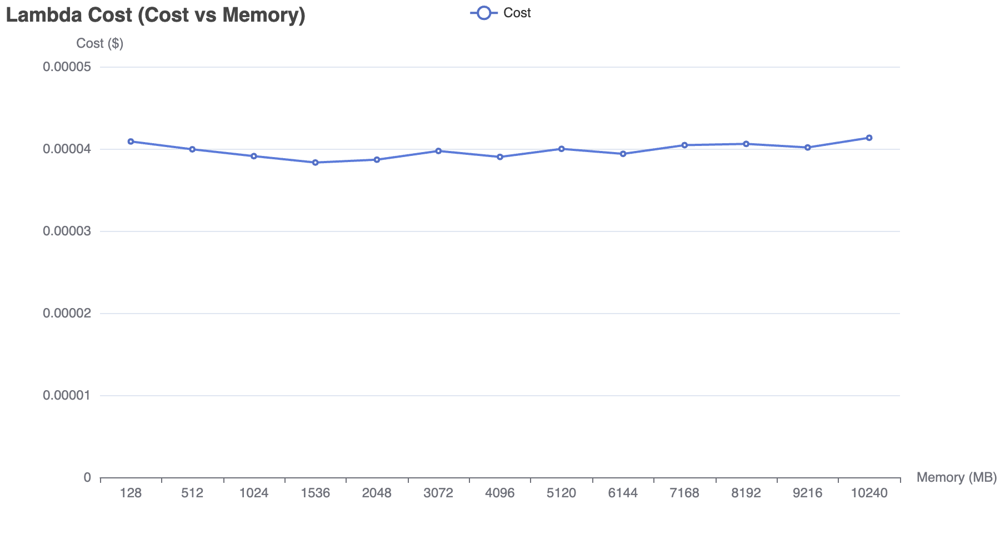
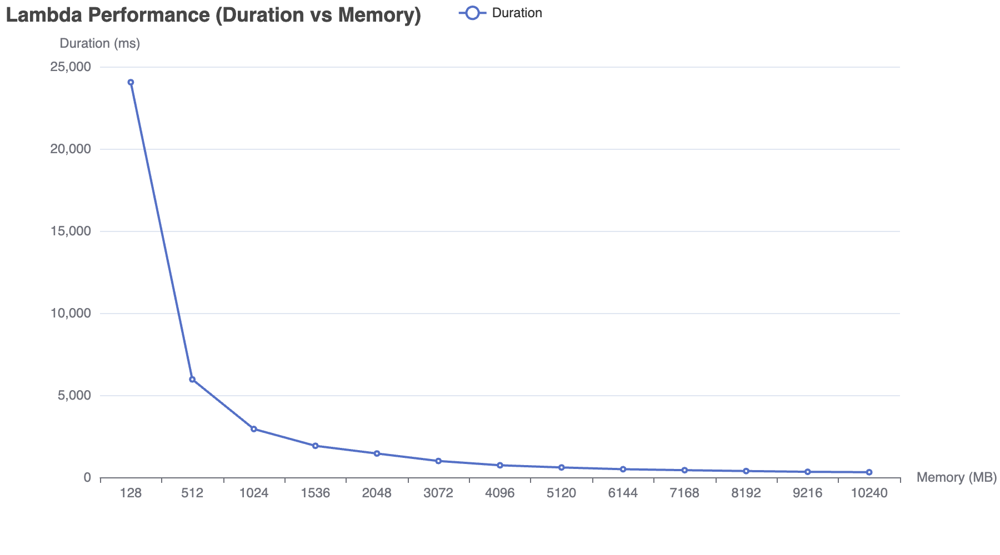

# Lambda Right-Sizer

A command-line interface (CLI) tool designed to optimize AWS Lambda functions by evaluating different memory configurations. It runs your Lambda function with various memory settings, collects performance metrics and cost data, and recommends the optimal configuration for both speed and cost efficiency.



## Features

- **Memory Configuration Testing**:
  - Automatically update Lambda function configuration.
  - Test multiple memory settings.
  - Evaluate performance based on execution duration and cost.



- **Cost & Performance Analysis**:
  - Analyze execution duration to determine the performance sweet spot.
  - Calculate cost for each memory configuration.
  - Recommend optimal settings for both performance and cost.

- **Visualization**:
  - Generate interactive charts using go-echarts.
  - Visualize performance, cost, and a combined balanced view.
  - Export visualizations to an HTML file for detailed analysis.



## Installation

### Building from Source

Ensure you have Go installed on your system. Then, clone the repository and build the binary:

```sh
git clone https://github.com/bit-cloner/lambda-right-sizer.git
cd lambda-right-sizer
go build
```

This will generate a binary named `lambda-right-sizer`.
## Installation

Download the appropriate binary for your operating system and CPU architecture:

### For Apple Silicon MAC OS (arm64)

```sh
VERSION=$(curl -sL -o /dev/null -w %{url_effective} https://github.com/bit-cloner/lambda-right-sizer/releases/latest | sed 's#.*/tag/##')

curl -LO https://github.com/bit-cloner/lambda-right-sizer/releases/download/$VERSION/lrs-$VERSION-darwin-arm64.tar.gz

tar -xzf lrs-$VERSION-darwin-arm64.tar.gz

chmod +x lrs

./lrs
```

### For Intel-based MAC OS

```sh
VERSION=$(curl -sL -o /dev/null -w %{url_effective} https://github.com/bit-cloner/lambda-right-sizer/releases/latest | sed 's#.*/tag/##')

curl -LO https://github.com/bit-cloner/lambda-right-sizer/releases/download/$VERSION/lrs-$VERSION-darwin-amd64.tar.gz

tar -xzf lrs-$VERSION-darwin-amd64.tar.gz

chmod +x lrs

./lrs
```

### Linux

#### For x86_64 systems

```sh
VERSION=$(curl -sL -o /dev/null -w %{url_effective} https://github.com/bit-cloner/lambda-right-sizer/releases/latest | sed 's#.*/tag/##')

curl -LO https://github.com/bit-cloner/lambda-right-sizer/releases/download/$VERSION/lrs-$VERSION-linux-amd64.tar.gz

tar -xzf lrs-$VERSION-linux-amd64.tar.gz

chmod +x lrs

./lrs
```

#### For ARM64 systems

```sh
VERSION=$(curl -sL -o /dev/null -w %{url_effective} https://github.com/bit-cloner/lambda-right-sizer/releases/latest | sed 's#.*/tag/##')

curl -LO https://github.com/bit-cloner/lambda-right-sizer/releases/download/$VERSION/lrs-$VERSION-linux-arm64.tar.gz

tar -xzf lrs-$VERSION-linux-arm64.tar.gz

chmod +x lrs

./lrs
```

### Windows

```sh
# For 64-bit systems
$VERSION = (Invoke-WebRequest -Uri "https://github.com/bit-cloner/lambda-right-sizer/releases/latest" -UseBasicParsing).BaseResponse.ResponseUri -replace ".*/tag/", ""

Invoke-WebRequest -Uri https://github.com/bit-cloner/lambda-right-sizer/releases/download/$VERSION/lrs-$VERSION-windows-amd64.zip -OutFile lrs.zip

Expand-Archive -Path lrs.zip -DestinationPath .

# For 32-bit systems
$VERSION = (Invoke-WebRequest -Uri "https://github.com/bit-cloner/lambda-right-sizer/releases/latest" -UseBasicParsing).BaseResponse.ResponseUri -replace ".*/tag/", ""

Invoke-WebRequest -Uri https://github.com/bit-cloner/lambda-right-sizer/releases/download/$VERSION/lrs-$VERSION-windows-386.zip -OutFile lrs.zip

Expand-Archive -Path lrs.zip -DestinationPath .
```

## Usage

Run the CLI tool from your terminal:

```sh
./lrs
```


The CLI will prompt you for:
- **Lambda ARN**: Enter the ARN of the Lambda function you wish to test.
- **Test Event Data**: Optionally provide custom JSON-formatted test event data.
- **Visualization Option**: Choose whether to generate an interactive HTML visualization of the test results.

The tool will then execute tests across multiple memory configurations, output performance and cost metrics, and (if selected) create a `visualization.html` file with interactive charts.

## Configuration

- **Lambda ARN**: The ARN of the Lambda function to be optimized.
- **Test Event Data**: Custom JSON data for triggering the function, if required.
- **Visualization**: Option to generate an HTML page with charts displaying performance and cost analysis.

## Contributing

Contributions are welcome! Please open issues and submit pull requests for improvements.

## License

This project is licensed under the MIT License.
